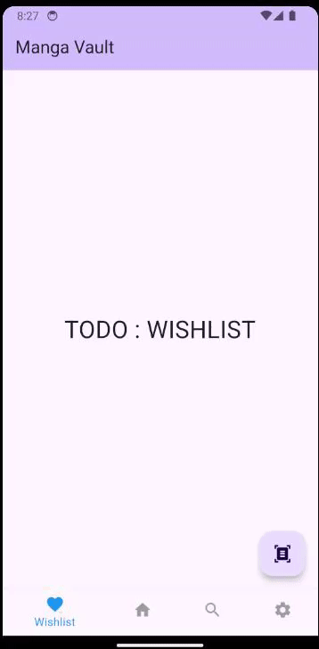
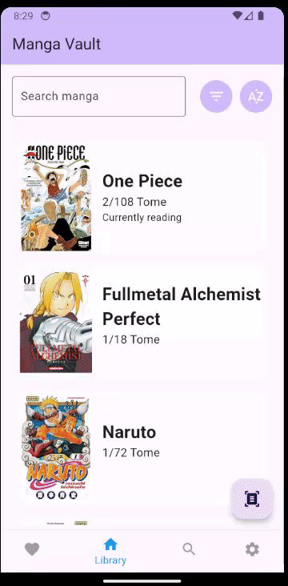
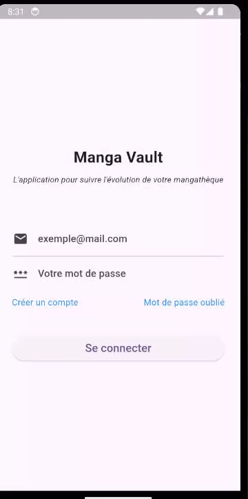
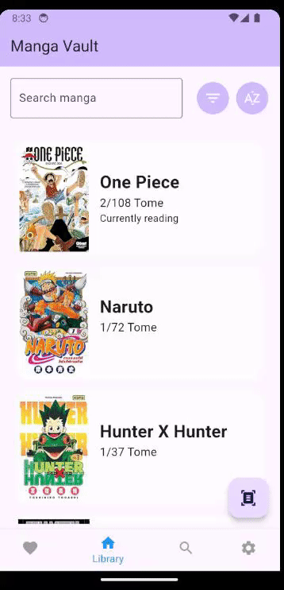
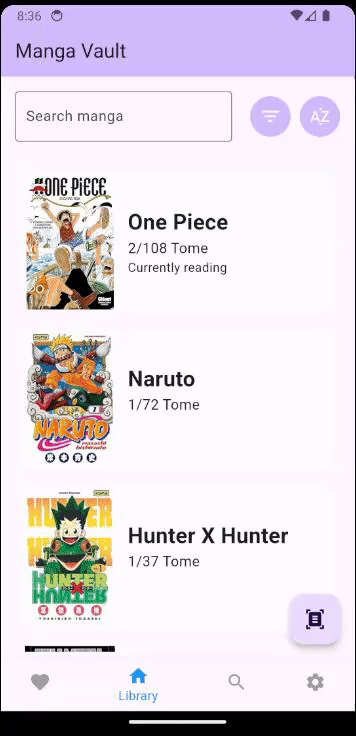

# MangaCollect

## 📁 Présentation des Principaux Dossiers

> Une présentation des principaux dossiers de votre dépôt. Quelles sont les différentes ressources qu'il contient à la racine ? Par exemple, les maquettes, vos inspirations, etc. Si vous avez fait des efforts quant à l'organisation de vos fichiers dans le dossier `lib`, expliquez-les ici.


Voici la structure des principaux dossiers et fichiers de ce projet :

- **assets/image** : Contient les images utilisées dans l'application.
- **lib/l10n** : Contient les fichiers de traduction (`app_en.arb`, `app_fr.arb`).
- **lib/model** : Contient les modèles utilisés dans l'application (`my_books`, `serie`, `tome`, `wishlist`).
- **lib/screen** : Contient les différents écrans de l'application (`login`, `isbn_scanner`, `mylibrarypage`, `options`, `series_details_page`, `tome_detail_page`).
- **lib/service** : Contient les services utilisés dans l'application, comme `firestore_service`.
- **lib/widget** : Contient des widgets réutilisables comme `scanner_widget`.
- **routes.dart** : Gère la navigation et les routes de l'application.
- **main.dart** : Le point d'entrée principal de l'application.

## 🚀 Présentation de l'Application

> Une présentation de votre application. Ce dernier répond à un besoin, présentez-le. Ne faites aucune hypothèse sur le niveau de connaissances de votre lecteur. Vous vous adressez ici à un internaute quelconque qui découvre votre dépôt. Évitez un jargon technique dans cette partie de votre présentation.

**MangaCollect** est une application qui permet de gérer une bibliothèque de mangas personnelle. Elle offre des fonctionnalités telles que :

- Scanner un ISBN pour ajouter un manga à votre collection.
- Visualiser tous les mangas que vous possédez.
- Gérer une wishlist de mangas et la partager avec vos amis.
- Rechercher des mangas via une barre de recherche.
- Suivre l'évolution de vos lectures de mangas.

## 🌐 Étude de l'Existant

> Une brève étude de l'existant. L'idée étant de savoir si d'autres ont déjà couvert le besoin auquel vous essayez de répondre. Ce qui est demandé ici, au-delà d'une brève description, ce sont les points forts et les points faibles de ces différentes applications. Il peut être intéressant de faire un tableau pour mettre en regard les avantages et les inconvénients. Enfin, mettez des captures d'écran des applications afin que l'on comprenne mieux de quoi on parle.


Il existe plusieurs applications permettant de gérer des collections de livres, mais peu d'entre elles se concentrent spécifiquement sur les mangas. Certaines applications généralistes permettent de gérer des bibliothèques, mais elles ne proposent pas toutes des fonctionnalités avancées comme la recherche via ISBN, le partage de wishlist, ou la gestion des mangas spécifiquement.

| Application     | Avantages                                                       | Inconvénients                                                   |
|-----------------|-----------------------------------------------------------------|-----------------------------------------------------------------|
| **Mangacollec**   | Planning personnalisé des sorties, wishlist| |
| **Goodreads**   | Large base de données, communauté active, fonctionnalités de recherche | Pas spécifiquement orientée manga, interface parfois surchargée |
| **MyAnimeList** | Base de données dédiée aux mangas et anime, interface claire   | Manque de certaines fonctionnalités comme le partage de wishlist |
| **MangaDex**    | Plateforme dédiée aux mangas, ajout rapide de mangas           | Pas de gestion complète de collection                           |


## 🎯 Public Cible

L'application est destinée aux **amateurs de mangas** souhaitant organiser, suivre et partager leur collection de mangas. Elle prend en compte les besoins suivants :

- **Les collectionneurs de mangas** qui souhaitent organiser leurs livres et suivre leur lecture.
- **Les utilisateurs sociaux** qui veulent partager leur wishlist de mangas avec leurs amis.
- **Les lecteurs réguliers** qui cherchent une méthode rapide et efficace pour ajouter des mangas à leur collection via le scan d'un ISBN.


## 📋 Fonctionnalités


Voici les principales fonctionnalités de l'application, présentées sous forme de récits utilisateurs (user stories) :

- **Scanner un ISBN** : En tant qu'utilisateur, je veux scanner un ISBN afin d'ajouter un manga à ma collection.
- **Partager la wishlist** : En tant qu'utilisateur, je veux partager ma wishlist pour que mes amis voient mes souhaits.
- **Barre de recherche** : En tant qu'utilisateur, je veux chercher un manga afin de voir sa fiche.
- **Suivre l’évolution d’un manga** : En tant qu'utilisateur, je veux marquer que je suis en lecture d’un manga afin de suivre son évolution.
- **Connexion utilisateur** : En tant qu'utilisateur, je souhaite me connecter afin d'utiliser l'application.
- **Création de compte** : En tant qu'utilisateur, je souhaite me créer un compte.
- **Afficher les mangas possédés** : En tant qu'utilisateur, je veux voir tous les mangas que je possède.
- **Voir les détails d’un tome** : En tant qu'utilisateur, je veux voir en détail un tome.
- **Classer par série** : En tant qu'utilisateur, je veux classer mes mangas par série pour mieux m’y retrouver.


## 📈 État d'Avancement

>  Un état d'avancement pour chaque fonctionnalité de votre application. Ceci doit évidemment être mis à jour régulièrement. Dès lors que vous aurez terminé de programmer une fonctionnalité, ajoutez dans le document `README.md` un `.gif` qui l'illustre. Vous pouvez vous servir de [GIF Brewery](https://apps.apple.com/us/app/gif-brewery-3-by-gfycat/id1081413713?mt=12) (Si vous êtes sous macOS) ou de [Gyazo](https://gyazo.com) (Si vous êtes sous Windows).


| Fonctionnalité                     | Statut       | Description                          | Illustration|
|-------------------------------------|--------------|--------------------------------------|------------|
| Scanner un ISBN                    | En cours     | Fonctionnalité de scan d'ISBN.       ||
| Partager la wishlist                | En cours     | Permet le partage de la wishlist.   ||
| Barre de recherche                  | Terminé      | Permet de rechercher un manga.      ||
| Suivre l’évolution d’un manga      | Terminé      | Marquer un manga comme en cours de lecture. ||
| Connexion utilisateur               | Terminé      | Authentification par email/mot de passe. ||
| Création de compte                  | Terminé      | Création d'un compte utilisateur.   ||
| Afficher les mangas possédés        | Terminé      | Affichage de la collection.         ||
| Voir les détails d’un tome          | Terminé      | Affichage des informations d’un tome.||
| Classer par série                   | Terminé      | Classement des mangas par série.    ||


## ⚙️ Compilation de l'Application

### Prérequis
Avant de compiler l'application, assurez-vous d'avoir les éléments suivants installés :

- **Java 17** : Vous pouvez télécharger et installer la version appropriée de Java depuis le site officiel.
- **SDK Android 33** : Téléchargez et installez le SDK Android via Android Studio ou en utilisant l'outil en ligne de commande Android SDK.
- **Flutter SDK 3.5.3** : Vous devez également avoir Flutter installé. Vous pouvez le télécharger depuis le site officiel de Flutter.

#### Configuration Firebase
1. **Créer un projet Firebase** : Connectez-vous à [Firebase Console](https://console.firebase.google.com/), créez un projet ou utilisez un projet existant.
2. **Ajouter l'application Android à Firebase** : Dans votre projet Firebase, ajoutez une application Android en suivant les instructions sur la console.
3. **Récupérer `google-services.json`** : Téléchargez le fichier `google-services.json` depuis Firebase et placez-le dans le répertoire `app` de votre projet Flutter.
4. **Activer Firestore** : Allez dans la console Firebase et activez Firestore dans la section "Database".
5. **Configurer Firebase Authentication** : Activez l'authentification par e-mail et mot de passe dans la console Firebase sous la section "Authentication".

### Structure de la Base de Données Firestore
Votre base de données Firestore contiendra les collections suivantes :

- **friend_whishlist** : Liste des livres souhaités par les amis.
- **user_owned_book** : Liste des mangas possédés par l'utilisateur.
- **user_whishlist** : Liste des mangas souhaités par l'utilisateur.
- **manga_db** : Base de données des mangas avec les informations suivantes pour chaque manga (exemple pour *Dragon Ball*) :

```json
{
  "Vol1" : {
    "cover": "https://m.media-amazon.com/images/I/81MLbWlVeCL._SY342_.jpg",
    "isbn_10": "2723446905",
    "isbn_13": "978-2723446907",
    "name": "Dragon Ball - Édition originale - Tome 09: En cas de problème, allez voir Baba la voyante",
    "summary": ""
  },
  "Vol2" :{..},
  "categories": [
    "Action",
    "Aventure",
    "Science-fiction",
    "Comédie",
    "Combat"
  ],
  "author": "Akira Toriyama",
  "main_cover": "https://m.media-amazon.com/images/I/81TkSJw2vqL._SL1500_.jpg",
  "nb_volume": 42,
  "series_id": 1234
}
```

#### Compilation

1. **Génerer les traduction** : Pour générer les fichiers de traduction dans votre projet, exécutez la commande suivante :
```
flutter pub run intl_utils:generate
```
2. **Compilation** :
```
flutter pub get
```


<!-- vim: set spelllang=fr :-->